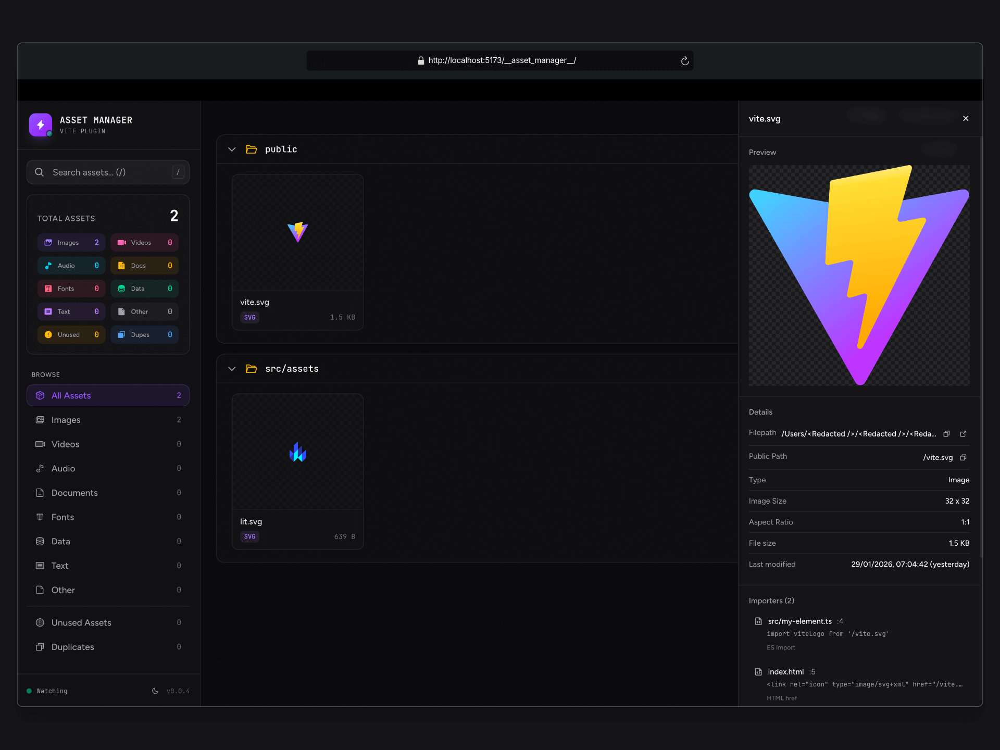

<p align="center">
  
</p>

<h1 align="center">vite-plugin-asset-manager</h1>

<p align="center">
  A visual asset management dashboard for Vite projects.<br/>
  Discover, browse, and manage all your media assets through a real-time web UI.
</p>

<p align="center">
  <a href="https://www.npmjs.com/package/vite-plugin-asset-manager"></a>
  <a href="https://www.npmjs.com/package/vite-plugin-asset-manager"></a>
  
  
  
  <a href="https://deepwiki.com/ejirocodes/vite-plugin-asset-manager"></a>
</p>

<p align="center">
  <a href="#installation">Installation</a> •
  <a href="#usage">Usage</a> •
  <a href="#features">Features</a> •
  <a href="#configuration">Configuration</a> •
  <a href="#keyboard-shortcuts">Shortcuts</a>
</p>

---

## Installation

```bash
npm install vite-plugin-asset-manager -D
# or
pnpm add vite-plugin-asset-manager -D
# or
yarn add vite-plugin-asset-manager -D
```

## Usage

```ts
// vite.config.ts
import { defineConfig } from 'vite'
import AssetManager from 'vite-plugin-asset-manager'

export default defineConfig({
  plugins: [AssetManager()],
})
```

Start your dev server and access the Asset Manager in three ways:
- Visit `/__asset_manager__/` directly in your browser
- Press **`⌥⇧A`** (Option+Shift+A) to toggle the floating panel
- Click the floating icon button injected into your app (drag to reposition)

## Features

| Feature | Description |
|---------|-------------|
| **Asset Discovery** | Automatically scans and catalogs images, videos, audio, fonts, documents, and data files |
| **Real-time Updates** | File changes reflected instantly via Server-Sent Events |
| **Floating Icon** | Draggable & resizable overlay panel with keyboard shortcuts (⌥⇧A), snaps to all 4 edges |
| **Automatic Theming** | Light/dark mode support based on system preferences |
| **Thumbnail Generation** | Sharp-powered thumbnails with dual-tier caching |
| **Import Tracking** | See which files import each asset with click-to-open-in-editor |
| **Duplicate Detection** | Content-based deduplication using MD5 hashing |
| **Advanced Filtering** | Filter by size, date modified, and file extension |
| **Bulk Operations** | Multi-select for batch download (ZIP), copy paths, or delete |
| **Keyboard Navigation** | Full keyboard support with vim-style bindings |
| **Context Menu** | Right-click for quick actions (copy, reveal in Finder, delete, etc.) |

## Framework Support

| Framework | Status |
|-----------|--------|
| Vanilla | ✅ |
| Vue | ✅ |
| React | ✅ |
| Preact | ✅ |
| Lit | ✅ |
| Svelte | ✅ |
| Solid | ✅ |
| Qwik | ✅ |

## Configuration

```ts
assetManager({
  base: '/__asset_manager__',     // Dashboard URL path
  include: ['src', 'public'],     // Directories to scan
  exclude: ['node_modules', '.git', 'dist'],
  thumbnailSize: 200,             // Thumbnail dimensions (px)
  floatingIcon: true,             // Show toggle button in host app
  watch: true,                    // Enable real-time updates
  launchEditor: 'code',           // Editor: code, cursor, webstorm, vim, etc.
})
```

## Asset Types

| Type | Extensions |
|------|------------|
| Image | `png` `jpg` `jpeg` `gif` `svg` `webp` `avif` `ico` `bmp` `tiff` `heic` |
| Video | `mp4` `webm` `ogg` `mov` `avi` |
| Audio | `mp3` `wav` `flac` `aac` |
| Document | `pdf` `doc` `docx` `xls` `xlsx` `ppt` `pptx` |
| Font | `woff` `woff2` `ttf` `otf` `eot` |
| Data | `json` `csv` `xml` `yml` `yaml` `toml` |
| Text | `md` `txt` |

## Keyboard Shortcuts

| Action | Shortcut |
|--------|----------|
| Navigate grid | `←` `↑` `→` `↓` or `j`/`k` |
| Focus search | `/` |
| Close preview | `Escape` |
| Toggle selection | `Space` |
| Open preview | `Enter` |
| Select all | `⌘A` / `Ctrl+A` |
| Copy paths | `⌘C` / `Ctrl+C` |
| Open in editor | `⌘O` / `Ctrl+O` |
| Reveal in Finder | `⌘⇧R` / `Ctrl+Shift+R` |
| Delete | `Delete` / `Backspace` |

## API Endpoints

The plugin exposes REST endpoints at `{base}/api/`:

<details>
<summary>View all endpoints</summary>

| Endpoint | Method | Description |
|----------|--------|-------------|
| `/assets` | GET | List all assets |
| `/assets/grouped` | GET | Assets grouped by directory |
| `/search?q=` | GET | Search by name/path |
| `/thumbnail?path=` | GET | Get image thumbnail |
| `/file?path=` | GET | Serve original file |
| `/stats` | GET | Asset statistics |
| `/importers?path=` | GET | Files importing the asset |
| `/duplicates?hash=` | GET | Assets with matching content hash |
| `/open-in-editor` | POST | Open file in editor |
| `/reveal-in-finder` | POST | Reveal in system file explorer |
| `/bulk-download` | POST | Download as ZIP |
| `/bulk-delete` | POST | Delete multiple assets |
| `/events` | GET | SSE stream for real-time updates |

</details>

## Development

```bash
pnpm install          # Install dependencies
pnpm run build        # Build UI + plugin
pnpm run dev          # Watch mode

# Testing
pnpm run test         # Run all tests
pnpm run test:watch   # Watch mode
pnpm run test:coverage

# Playgrounds
pnpm run playground:react
pnpm run playground:vue
pnpm run playground:vanilla
pnpm run playground:preact
pnpm run playground:lit
pnpm run playground:svelte
pnpm run playground:solid
pnpm run playground:qwik
```

## License

[MIT](LICENSE)
